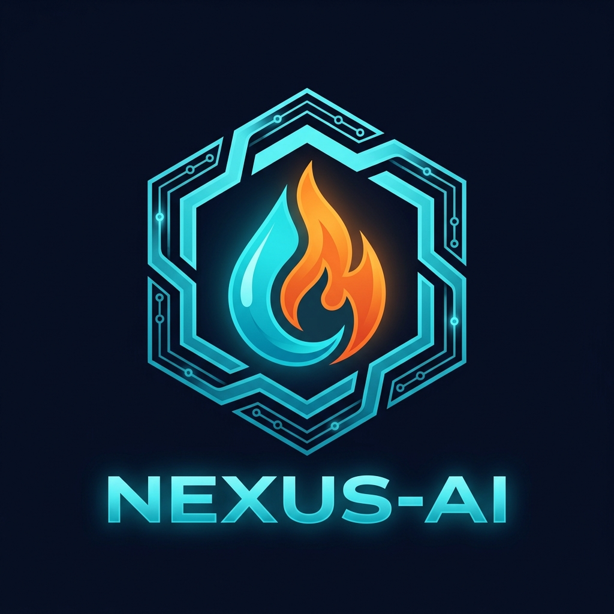

# 🔷 HydroThermal Nexus-AI v2.0

> **A Showcase-Ready AI for Sustainability** — Enterprise-grade industrial IoT operational
> cockpit for real-time hydrothermal facility monitoring, AI-driven anomaly detection,
> ESG impact tracking, and automated incident response.



---

## 📋 Problem Statement

Modern hydrothermal facilities (data centres, industrial campuses, hospital complexes)
waste **15–30% of their water and energy resources** due to:

| Challenge | Real-World Impact |
|-----------|------------------|
| Undetected pipe ruptures | Up to 1,450 L/hr water loss per incident |
| HVAC thermal exceedance | 38+ kg CO₂e excess emissions per event |
| Manual monitoring lag | Anomalies go undetected for 4–8 hours |
| No ESG audit trail | Non-compliance with ISO 14001 / GHG Protocol |
| Siloed alert systems | Critical incidents missed by operations teams |

**HydroThermal Nexus-AI** solves these with a fully automated, AI-powered
operational cockpit that detects, diagnoses, mitigates, and reports incidents
in real time — with full regulatory audit capability.

---

## 🎯 Success Metrics

| Metric | Target | Measured By |
|--------|--------|-------------|
| Anomaly detection latency | < 15 minutes | Alert timestamp − sensor timestamp |
| Water saved per incident | ≥ 1,000 L/hr | Valve restriction × flow rate |
| CO₂ prevented per event | ≥ 30 kg CO₂e | HVAC efficiency × emission factor |
| ESG Score | ≥ 80/100 | Composite of water, CO₂, energy, uptime |
| System health score | ≥ 90/100 | Multi-sensor weighted average |
| Alert delivery latency | < 30 seconds | Telegram API response time |

---

## 🏗️ System Architecture

```
┌─────────────────────────────────────────────────────────┐
│               Industrial IoT Sensors                     │
│  [Pressure] [Thermometer] [Flow Meter] [Energy Meter]   │
└──────────────────────┬──────────────────────────────────┘
                       │ Telemetry Stream (6h intervals)
          ┌────────────▼────────────┐
          │   Streamlit UI          │
          │   (Port 8501)           │
          │  ┌──────────────────┐   │
          │  │ Login / RBAC Auth│   │
          │  │ 9 Dashboard Tabs │   │
          │  │ Plotly Charts    │   │
          │  │ PyDeck 3D Twin   │   │
          │  └──────────────────┘   │
          └──────────┬──────────────┘
                     │ Internal API calls
          ┌──────────▼──────────────┐    ┌─────────────────────┐
          │   FastAPI Backend       │    │   SQLite Databases   │
          │   (Port 8001)           │◄───│  nexus_auth.db       │
          │  REST Endpoints         │    │  nexus_audit.db      │
          │  API Key Auth           │    │  nexus_storage.db    │
          │  CORS enabled           │    └─────────────────────┘
          └──────────┬──────────────┘
          ┌──────────▼──────────────┐    ┌─────────────────────┐
          │   AI / ML Engine        │    │   Alert Channels     │
          │  IsolationForest Model  │    │  Telegram Bot API    │
          │  Z-Score Detector       │    │  Email (SMTP/TLS)    │
          │  RCA Engine             │    │  In-App Center       │
          │  AI Chatbot (12 topics) │    └─────────────────────┘
          └─────────────────────────┘
```

---

## 🚀 Quick Start

### Prerequisites
- Python 3.11+
- pip

### Installation
```bash
# Clone / navigate to project
cd HydroThermal_Nexus_AI

# Install dependencies
pip install -r requirements.txt

# Run the app
streamlit run app.py
```

Open **http://localhost:8501** in your browser.

### Docker (Production)
```bash
docker-compose up --build
# Streamlit: http://localhost:8501
# FastAPI:   http://localhost:8001/docs
```

---

## 🔐 Default Credentials

| Role | Username | Password | Permissions |
|------|----------|----------|-------------|
| **Admin** | `admin` | `Admin@Nexus2026!` | Full access — all 15 permissions |
| **Operator** | `operator1` | `Operator@2026#` | Trigger anomalies, send alerts, download reports |
| **Viewer** | `viewer1` | `Viewer@View123` | Read-only dashboard access |

> ⚠️ **Change all default passwords immediately in production.**

---

## 📑 Feature Tabs

| # | Tab | Key Features |
|---|-----|-------------|
| 1 | 🏠 Command Center | Health ring gauge, KPI cards, live sparklines, recent alert feed |
| 2 | 📈 Telemetry & Analytics | Live sensor streaming, Plotly multi-chart, correlation heatmap |
| 3 | 🌐 Digital Twin | PyDeck 3D geo-spatial node map, real-time status cards |
| 4 | 🤖 RCA Engine | AI root cause analysis, mitigation path, branded PDF download |
| 5 | 🌱 ESG Dashboard | CO₂/water/energy trends, ESG score timeline, financial calculator |
| 6 | 🚨 Alert Center | Multi-channel dispatch, severity levels, ACK system |
| 7 | 💬 AI Assistant | Domain-aware chatbot, 12-topic knowledge base, quick chips |
| 8 | 📊 Data Insights | EDA stats, IsolationForest model training, data dictionary |
| 9 | 📜 Audit & Compliance | Immutable audit trail, CSV export, admin controls |

---

## 🤖 AI / ML Stack

### 1. IsolationForest (sklearn)
- **Purpose**: Unsupervised anomaly detection on 6-feature telemetry
- **Features**: `Electricity_kWh`, `Water_Litres`, `Pressure_PSI`, `Thermal_Temp_C`, `Outdoor_Temp_C`, `Humidity_Pct`
- **Contamination**: 5% (configurable)
- **Output**: `IF_Anomaly` (bool) + `IF_Score` (0–100 risk score)

### 2. Adaptive Z-Score Engine
- **Purpose**: Fast per-sensor threshold detection with environmental adjustment
- **Humidity adjustment**: `adjusted_mean = base + (humidity × 0.15)`
- **Temperature adjustment**: `adjusted_mean = base + max(0, temp−30) × 85`
- **Threshold**: Z > 3.5 → anomaly flag

### 3. AI Chatbot
- **Domain**: 12-topic knowledge base (anomaly detection, ESG, security, RBAC, sensors, reports…)
- **State-aware**: Reads current anomaly and health score into each response
- **Intent detection**: Keyword + phrase fuzzy matching

---

## 🌱 ESG Impact Model

```
ESG Score = (water_score × 0.35) + (co2_score × 0.35) 
          + (energy_score × 0.20) + (uptime_score × 0.10)

Financial Value = (water_saved_L × ₹0.05/L)
               + (energy_saved_kWh × ₹8/kWh)
               + (co2_saved_kg × $15/tonne)
```

---

## 🔐 Security Architecture

| Layer | Implementation |
|-------|---------------|
| Authentication | SHA-256 + application salt; 5-attempt lockout |
| Session Management | UUID4 tokens, 8-hour expiry, SQLite-backed |
| Authorization | RBAC — 3 roles × 15 explicit permissions |
| Input Validation | HTML escaping + SQL keyword stripping |
| Data Privacy | PII fields auto-hashed (SHA-256) on ingestion |
| API Security | FastAPI `X-API-Key` header authentication |
| Container Security | Non-root Docker user (`nexususer`, UID 1000) |

---

## 📁 Project Structure

```
HydroThermal_Nexus_AI/
├── app.py                   # Main Streamlit app (9 tabs, auth, UI)
├── ml_engine.py             # IsolationForest + Z-score anomaly engine
├── ai_assistant.py          # Domain-aware AI chatbot
├── alert_manager.py         # Multi-channel alert dispatcher
├── data_processor.py        # CSV/XLSX ingestion + PII anonymization
├── actuators.py             # Hardware actuation simulation
├── rca_engine.py            # Root cause analysis engine
├── report_generator.py      # ReportLab PDF generator
├── config.py                # Baseline constants & RBAC config
│
├── backend/
│   ├── api.py               # FastAPI REST endpoints (port 8001)
│   ├── database.py          # Thread-safe SQLite access layer
│   └── security.py          # RBAC checks, sanitization, PII masking
│
├── assets/
│   ├── logo.png             # Custom AI-generated project logo
│   ├── architecture.png     # System architecture diagram
│   └── styles.css           # Glassmorphism dark theme CSS
│
├── .streamlit/
│   └── config.toml          # Dark navy theme configuration
│
├── requirements.txt         # Python dependencies
├── Dockerfile               # Production Docker image (Python 3.11)
├── docker-compose.yml       # Multi-service compose with volumes
├── SCALING_STRATEGY.md      # Cloud deployment & scaling guide
└── README.md                # This file
```

---

## 📄 License
MIT License — Free for academic, commercial, and portfolio use.

---

*Built with ❤️ for the Innovation Journey — Showcase-Ready AI for Sustainability*
