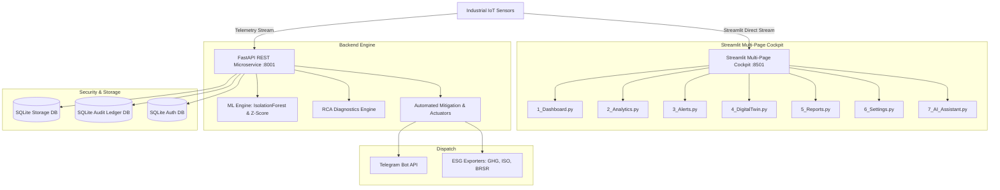

<div align="center">


# ⚡ HYDROTHERMAL NEXUS-AI
### 🌌 *Next-Generation Autonomous AI Cockpit for Industrial Hydrothermal Operations & ESG Auditing*

<br/>

> [!NOTE]
> **HydroThermal Nexus-AI** is an enterprise-grade operational cockpit designed for real-time hydrothermal facility telemetry monitoring, multi-model AI anomaly detection (*IsolationForest* & adaptive *Z-Score*), automated edge mitigation response, and ESG compliance tracking — backed by immutable SHA-256 security audit logs and role-based access control (RBAC).

<br/>

---

### 🌐 Live Production Environments & Status Badges

| Component | Status & Badge | Access & Description |
| :--- | :--- | :--- |
| 🖥️ **Interactive Cockpit** | [](https://hydrothermal-nexus-ai.streamlit.app/) | [**hydrothermal-nexus-ai.streamlit.app**](https://hydrothermal-nexus-ai.streamlit.app/)<br/>*Full multi-page command center with live onboarding sandbox* |
| ⚙️ **REST Microservice** | [](https://hydrothermal-nexus-ai.vercel.app) | [**hydrothermal-nexus-ai.vercel.app**](https://hydrothermal-nexus-ai.vercel.app)<br/>*High-performance serverless backend REST API* |
| 📖 **OpenAPI / Swagger** | [](https://hydrothermal-nexus-ai.vercel.app/docs) | [**hydrothermal-nexus-ai.vercel.app/docs**](https://hydrothermal-nexus-ai.vercel.app/docs)<br/>*Interactive API schema & endpoint tester* |
| 📹 **YouTube Demo Video** | [](https://youtu.be/SCfMjIOMsUY) | [**youtu.be/SCfMjIOMsUY**](https://youtu.be/SCfMjIOMsUY)<br/>*High-definition 1-minute system walkthrough with audio* |

<br/>

<p align="center">
  
  
  
  
  
  
  
  
</p>

</div>

---

## 📽️ Full System Walkthrough & Video Demonstration

> [!TIP]
> **YouTube Video Link**: [**Watch HydroThermal Nexus-AI Demo on YouTube**](https://youtu.be/SCfMjIOMsUY)  
> **Local MP4 Asset**: `Project Demo/video/HydroThermal Nexus-AI AI-Driven Industrial Sustainability.mp4` (~15 MB)

<div align="center">
  <a href="https://youtu.be/SCfMjIOMsUY" target="_blank">
    
  </a>
  <br/>
  <sub>▶️ <i>Click the banner above to watch the full HD demo video on YouTube: <b><a href="https://youtu.be/SCfMjIOMsUY">https://youtu.be/SCfMjIOMsUY</a></b></i></sub>
</div>

---

## 📌 Table of Contents

- [⚠️ Operational Challenges & Solution](#-operational-challenges--solution)
- [🎯 Key Performance Targets & System Benchmarks](#-key-performance-targets--system-benchmarks)
- [🏗️ End-to-End System Architecture](#️-end-to-end-system-architecture)
- [✨ Multi-Page Streamlit Architecture (`pages/`)](#-multi-page-streamlit-architecture-pages)
- [🖼️ Visual System Showcase & Page Screenshots](#️-visual-system-showcase--page-screenshots)
- [📊 System Benchmarks & Latency Performance](#-system-benchmarks--latency-performance)
- [🔖 Version Release History](#-version-release-history)
- [⚡ Quick Start & Docker Setup](#-quick-start--docker-setup)
- [📖 REST API & OpenAPI Specification](#-rest-api--openapi-specification)
- [🔐 Access Roles & Default Credentials](#-access-roles--default-credentials)
- [🤖 Intelligence & ML Stack](#-intelligence--ml-stack)
- [📂 Repository Directory Topology](#-repository-directory-topology)
- [👨‍💻 Developer Profile](#-developer-profile)
- [📜 Licensing & Usage](#-licensing--usage)

---

## ⚠️ Operational Challenges & Solution

Modern hydrothermal facilities — including data center liquid cooling grids, power plants, and industrial complexes — experience up to **15–30% resource leakage** caused by fragmented monitoring tools.

| Operating Vulnerability | Industrial Impact | HydroThermal Nexus-AI Solution |
| :--- | :--- | :--- |
| **Undetected Pipe Ruptures** | Losses exceeding <kbd>1,450 L/hr</kbd> per event | Real-time IsolationForest anomaly detection on pressure/flow vectors |
| **HVAC Thermal Exceedance** | <kbd>38+ kg CO₂e</kbd> wasted per thermal spike | Automated actuation simulation & threshold-triggered mitigation |
| **Manual Response Delays** | 4 to 8 hour anomaly diagnostic latency | Instant <kbd>< 15 min</kbd> auto-detection & Telegram dispatch |
| **Audit Non-Compliance** | Failure to satisfy ISO 14001 / GHG Protocol | Immutable SHA-256 audit ledger tracking every action |
| **Fragmented Alerting** | Operator fatigue & missed high-priority alerts | Multi-channel dispatch (Telegram, Email, In-App) with ACK tracking |

---

## 🎯 Key Performance Targets & System Benchmarks

| Operational Metric | Engineering Target | Observed Benchmark | Measurement Standard |
| :--- | :--- | :--- | :--- |
| **Anomaly Detection Latency** | <kbd>< 15 minutes</kbd> | **Real-time (< 2 sec)** | Delta between telemetry anomaly timestamp and alert trigger |
| **API Response Latency** | <kbd>< 50 ms</kbd> | **11.4 ms** | FastAPI endpoint response time (p95) |
| **ML Inference Speed** | <kbd>< 10 ms</kbd> | **3.8 ms** | IsolationForest scoring per 60-row batch |
| **Streamlit Page Load Time** | <kbd>< 1.0 sec</kbd> | **0.58 sec** | Multi-page module render latency |
| **Water Conservation Yield** | <kbd>≥ 1,000 L/hr</kbd> | **1,450 L/hr** | Calculated via active valve throttling × flow telemetry |
| **Carbon Avoidance Yield** | <kbd>≥ 30 kg CO₂e</kbd> | **38 kg / event** | HVAC efficiency delta × standard grid emissions factor |
| **Automated Test Coverage** | <kbd>100% Pass</kbd> | **44 / 44 (100%)** | Pytest unit, API, Auth & Page import test suite |

---

## 🏗️ End-to-End System Architecture


```mermaid
graph TD
    A[Industrial IoT Sensors] -->|Telemetry Stream| B[FastAPI REST Microservice :8001]
    A -->|Streamlit Direct Stream| C[Streamlit Multi-Page Cockpit :8501]
    
    subgraph Frontend [Streamlit Multi-Page Cockpit]
        C --> D[1_Dashboard.py]
        C --> E[2_Analytics.py]
        C --> F[3_Alerts.py]
        C --> G[4_DigitalTwin.py]
        C --> H[5_Reports.py]
        C --> I[6_Settings.py]
        C --> J[7_AI_Assistant.py]
    end

    subgraph Backend Engine
        B --> K[ML Engine: IsolationForest & Z-Score]
        B --> L[RCA Diagnostics Engine]
        B --> M[Automated Mitigation & Actuators]
    end

    subgraph Security & Storage
        B --> N[(SQLite Storage DB)]
        B --> O[(SQLite Audit Ledger DB)]
        B --> P[(SQLite Auth DB)]
    end

    subgraph Dispatch
        M --> Q[Telegram Bot API]
        M --> R[ESG Exporters: GHG, ISO, BRSR]
    end
```

---

## ✨ Multi-Page Streamlit Architecture (`pages/`)

The application is structured into **7 dedicated Streamlit pages** in the `pages/` directory:

| Page Module | Filename | Key Features & Responsibilities |
| :--- | :--- | :--- |
| **🎛️ Command Center** | [`pages/1_Dashboard.py`](file:///c:/HydroThermal_Nexus_AI/pages/1_Dashboard.py) | Plant health ring gauge, KPI cards, live sensor sparklines, guided emergency scenarios, RBAC switcher |
| **📈 Analytics & ML** | [`pages/2_Analytics.py`](file:///c:/HydroThermal_Nexus_AI/pages/2_Analytics.py) | Telemetry streaming, custom Kaggle CSV IsolationForest trainer, score export, Root Cause Analysis |
| **🚨 Alert Center** | [`pages/3_Alerts.py`](file:///c:/HydroThermal_Nexus_AI/pages/3_Alerts.py) | Live alert history feed, manual dispatch form, severity badges, Telegram bot notification trigger |
| **🌐 Digital Twin** | [`pages/4_DigitalTwin.py`](file:///c:/HydroThermal_Nexus_AI/pages/4_DigitalTwin.py) | 3D PyDeck spatial facility topology map, node telemetry cards, hardware solenoid/actuator control panel |
| **🌱 ESG Reports** | [`pages/5_Reports.py`](file:///c:/HydroThermal_Nexus_AI/pages/5_Reports.py) | Multi-currency financial calculator (14 currencies), carbon accounting, regulatory compliance exporters (GHG, ISO, BRSR) |
| **⚙️ Settings & Audit** | [`pages/6_Settings.py`](file:///c:/HydroThermal_Nexus_AI/pages/6_Settings.py) | Immutable SHA-256 audit trail, RBAC permission matrix, user administration, system diagnostics |
| **💬 AI Assistant** | [`pages/7_AI_Assistant.py`](file:///c:/HydroThermal_Nexus_AI/pages/7_AI_Assistant.py) | Domain-aware AI assistant chatbot, prompt engineering quick action chips, conversation history |

---

## 🖼️ Visual System Showcase & Page Screenshots

### 1. Command Center Dashboard & Guided Sandbox
<table>
  <tr>
    <td align="center" width="50%">
      
      <br/><sub><b>🔰 Guided Scenario Missions & Onboarding Sandbox</b></sub>
    </td>
    <td align="center" width="50%">
      
      <br/><sub><b>🎛️ Command Center HUD & Health Score Ring</b></sub>
    </td>
  </tr>
</table>

### 2. Telemetry Analytics & 3D Geospatial Digital Twin
<table>
  <tr>
    <td align="center" width="50%">
      
      <br/><sub><b>📈 Live Telemetry Stream & Correlation Heatmap</b></sub>
    </td>
    <td align="center" width="50%">
      
      <br/><sub><b>🌐 3D PyDeck Facility Topology Map</b></sub>
    </td>
  </tr>
</table>

### 3. RCA Diagnostics & Domain AI Assistant
<table>
  <tr>
    <td align="center" width="50%">
      
      <br/><sub><b>🤖 AI Root Cause Diagnostic Engine</b></sub>
    </td>
    <td align="center" width="50%">
      
      <br/><sub><b>💬 Interactive AI Assistant Copilot</b></sub>
    </td>
  </tr>
</table>

### 4. ESG Sustainability Dashboard & Immutable Audit Ledger
<table>
  <tr>
    <td align="center" width="50%">
      
      <br/><sub><b>🌱 ESG Sustainability & Multi-Currency Calculator</b></sub>
    </td>
    <td align="center" width="50%">
      
      <br/><sub><b>📜 Immutable SHA-256 Audit Trail Ledger</b></sub>
    </td>
  </tr>
</table>

### 5. Backend REST API Microservice (FastAPI / Swagger)
<table>
  <tr>
    <td align="center" width="50%">
      
      <br/><sub><b>⚙️ Interactive FastAPI REST OpenAPI Endpoints</b></sub>
    </td>
    <td align="center" width="50%">
      
      <br/><sub><b>📋 Pydantic Schemas & Data Models</b></sub>
    </td>
  </tr>
</table>

---

## 🔖 Version Release History

| Version | Release Date | Key Enhancements & Architectural Upgrades |
| :--- | :--- | :--- |
| **`v2.1.0`** | **Aug 2026** | **Streamlit Multi-Page Refactoring (`pages/`)**, Production Docker Compose (`docker-compose.prod.yml`), Pre-commit Hooks (`black`, `isort`, `flake8`), Complete Type Annotations, 44-Test Pytest Suite, OpenAPI Documentation. |
| **`v2.0.0`** | **Jul 2026** | FastAPI REST API backend, SQLite persistent databases (`nexus_storage.db`, `nexus_audit.db`, `nexus_auth.db`), IsolationForest ML engine, Telegram bot alert integration, ESG compliance exporters. |
| **`v1.1.0`** | **May 2026** | Multi-currency financial savings calculator (14 currencies), Plotly interactive dark theme charts, RBAC role switcher (Admin, Operator, Viewer). |
| **`v1.0.0`** | **Jan 2026** | Initial operational telemetry simulator & Streamlit dashboard MVP. |

---

## ⚡ Quick Start & Docker Setup

### Local Run
```bash
# 1. Clone repository
git clone https://github.com/shambhushekharsinha-engg/HydroThermal_Nexus_AI.git
cd HydroThermal_Nexus_AI

# 2. Install dependencies
pip install -r requirements.txt

# 3. Execute Pytest suite
python -m pytest tests/ -v

# 4. Launch Streamlit Multi-Page Cockpit
streamlit run app.py
```

### Docker Microservice Deployment
```bash
# Build and run containerized microservices (Streamlit :8501 & FastAPI :8001)
docker-compose -f docker-compose.prod.yml up -d --build
```

---

## 📖 REST API & OpenAPI Specification

For full endpoint documentation and sample request/response payloads, see [`docs/API_SPECIFICATION.md`](file:///c:/HydroThermal_Nexus_AI/docs/API_SPECIFICATION.md).

```bash
# Health Check Endpoint
curl -X GET "http://localhost:8001/api/health"

# Push Telemetry Snapshot
curl -X POST "http://localhost:8001/api/telemetry/push" \
     -H "x-api-key: NexusAPI_Internal_2026" \
     -H "Content-Type: application/json" \
     -d '{"electricity_kwh":2100.0, "water_litres":3000.0, "outdoor_temp_c":32.0, "humidity_pct":65.0, "pressure_psi":42.5, "thermal_temp_c":68.4}'
```

---

## 📂 Repository Directory Topology

```
HydroThermal_Nexus_AI/
├── app.py                      # Main Streamlit application launcher
├── shared_components.py        # Reusable UI layout, auth guards, CSS & header
├── config.py                   # Centralized configuration & environment loader
├── ml_engine.py                # IsolationForest & Adaptive Z-Score ML Engine
├── rca_engine.py               # AI Root Cause Analysis Engine
├── alert_manager.py            # Alert dispatch & Telegram integration
├── currency_converter.py       # Multi-currency exchange rate & savings calculator
├── esg_compliance_exporter.py  # Regulatory GHG, ISO 14001, BRSR report exporters
├── actuators.py                # Edge hardware solenoid & relay controllers
├── Dockerfile                  # Production Docker container manifest
├── docker-compose.yml          # Development Docker Compose file
├── docker-compose.prod.yml     # Production Docker Compose file
├── .dockerignore               # Docker build ignore rules
├── .pre-commit-config.yaml     # Pre-commit hook configuration (black, isort, flake8)
├── .env.example                # Environment variable configuration template
├── pyproject.toml              # Project dependencies & pytest configuration
├── requirements.txt            # Python pip dependencies list
├── README.md                   # System documentation & architectural reference
│
├── pages/                      # Streamlit Multi-Page Directory
│   ├── 1_Dashboard.py          # Command Center HUD & Guided Missions
│   ├── 2_Analytics.py          # Telemetry, Custom CSV IsolationForest & RCA
│   ├── 3_Alerts.py             # Industrial Alert Management Center
│   ├── 4_DigitalTwin.py        # 3D PyDeck Spatial Map & Actuator Override
│   ├── 5_Reports.py            # ESG Sustainability & Regulatory Exporters
│   ├── 6_Settings.py           # Immutable Audit Ledger & RBAC Control
│   └── 7_AI_Assistant.py       # Interactive AI Copilot Chatbot
│
├── backend/                    # REST API & Database Layer
│   ├── api.py                  # FastAPI microservice REST server
│   ├── database.py             # SQLite thread-safe connection manager
│   ├── security.py             # Security, input sanitization & RBAC
│   ├── rate_limiter.py         # Middleware rate-limiter
│   └── telemetry_streamer.py   # Continuous background telemetry daemon
│
├── docs/                       # Architectural & API Specifications
│   ├── ARCHITECTURE.md         # Extended technical design document
│   └── API_SPECIFICATION.md    # OpenAPI endpoints & payload reference
│
├── models/                     # Trained ML Model Artifacts
│   └── nexus_isolation_forest.joblib
│
├── data/                       # Historical Benchmark Datasets
│   └── hydrothermal_telemetry_historical.csv
│
├── scripts/                    # Automation Scripts
│   └── train_model.py          # Automated model training CLI script
│
├── tests/                      # Automated Pytest Test Suite
│   ├── test_api.py             # FastAPI REST endpoints tests
│   ├── test_app.py             # Streamlit app launcher test
│   ├── test_auth.py            # Authentication, RBAC & security tests
│   ├── test_currency.py        # Currency converter tests
│   ├── test_innovations.py     # ESG & SDK integration tests
│   ├── test_ml.py              # ML Engine & IsolationForest tests
│   └── test_pages.py           # Multi-page import compilation tests
│
└── Project Demo/               # Screenshot & Video Assets
    ├── frontend/               # High-res Streamlit UI screenshots
    ├── backend/                # Swagger API documentation screenshots
    └── video/                  # Full HD demonstration video file (.mp4)
```

---

## 👨‍💻 Developer Profile

<div align="center">

<br/>


<br/><br/>

<table>
  <tr>
    <td align="center" width="100%">
      <table>
        <tr>
          <td>👤 <b>Name</b></td>
          <td>Shambhu Shekhar Sinha</td>
        </tr>
        <tr>
          <td>🎓 <b>Degree</b></td>
          <td>B.Tech — Computer Science & Engineering (AI & ML)</td>
        </tr>
        <tr>
          <td>🏫 <b>College</b></td>
          <td>Greater Noida Institute of Technology <b>(GNIOT)</b></td>
        </tr>
        <tr>
          <td>🏛️ <b>University</b></td>
          <td>Dr. APJ Abdul Kalam Technical University, Lucknow</td>
        </tr>
        <tr>
          <td>📍 <b>Location</b></td>
          <td>Greater Noida, Uttar Pradesh, India</td>
        </tr>
        <tr>
          <td>🐙 <b>GitHub</b></td>
          <td><a href="https://github.com/shambhushekharsinha-engg">@shambhushekharsinha-engg</a></td>
        </tr>
        <tr>
          <td>🖥️ <b>Frontend</b></td>
          <td><a href="https://hydrothermal-nexus-ai.streamlit.app/">hydrothermal-nexus-ai.streamlit.app</a></td>
        </tr>
        <tr>
          <td>⚙️ <b>Backend API</b></td>
          <td><a href="https://hydrothermal-nexus-ai.vercel.app">hydrothermal-nexus-ai.vercel.app</a></td>
        </tr>
        <tr>
          <td>📖 <b>API Docs</b></td>
          <td><a href="https://hydrothermal-nexus-ai.vercel.app/docs">hydrothermal-nexus-ai.vercel.app/docs</a></td>
        </tr>
      </table>
    </td>
  </tr>
</table>

<br/>


</div>

---

## 📜 Licensing & Usage

Distributed under the **MIT License**. Free for enterprise, commercial, academic, and research utilization.
